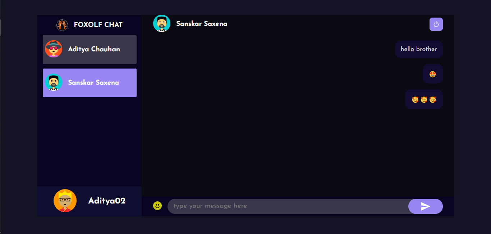

# foxolfChatApp
A chat App Using MERN Stack And Stock.io.

# SCREENSHOTS =>

# MAKE SURE YOU HAVE DOWNLOADED=>
 1. Node.js
 2. MongoDB Compass

# ADD .env FILES IN PUBLIC AND SERVER =>
 1. **public/.env =>**
        REACT_APP_LOCALHOST_KEY="chat-app-current-user"
 2. **server/.env =>**
        PORT=5000
        MONGO_URL="mongodb://127.0.0.1:27017/foxolf"
# ADD PUBLIC REPOSITRIES =>
 1. cd public
 2. yarn

# ADD SERVER REPOSITRIES =>
 1. cd server
 2. yarn
 
# START THE DEPLOYMENT =>
1. cd server/ yarn start
2. cd public/ yarn start
